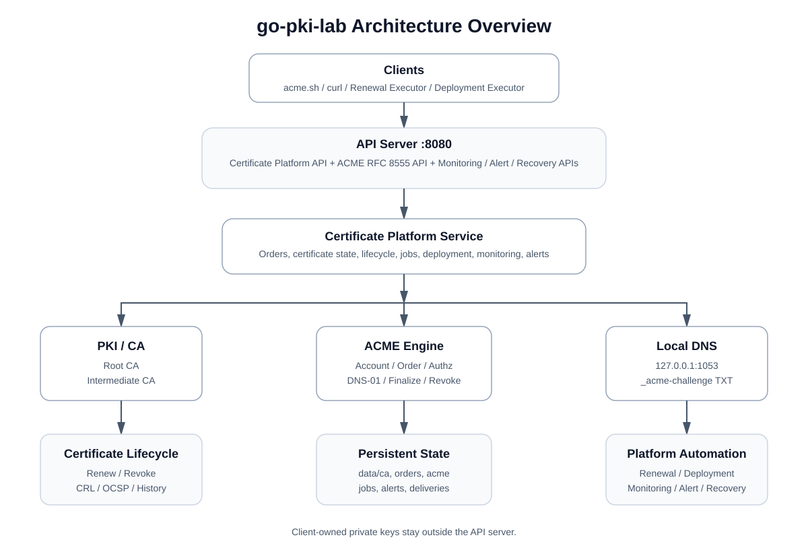
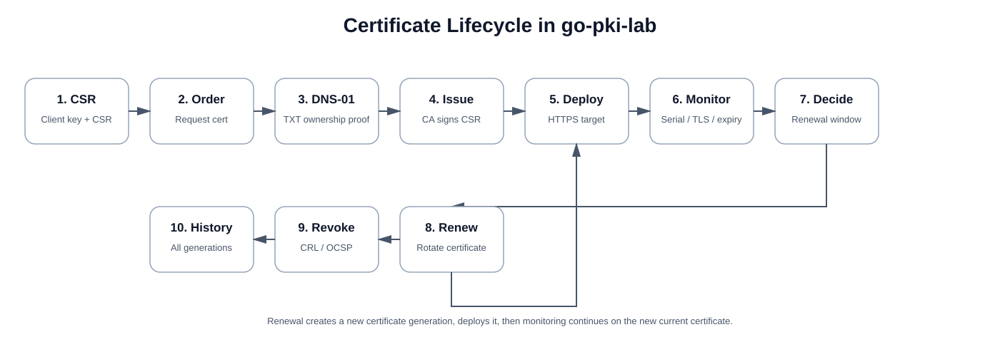
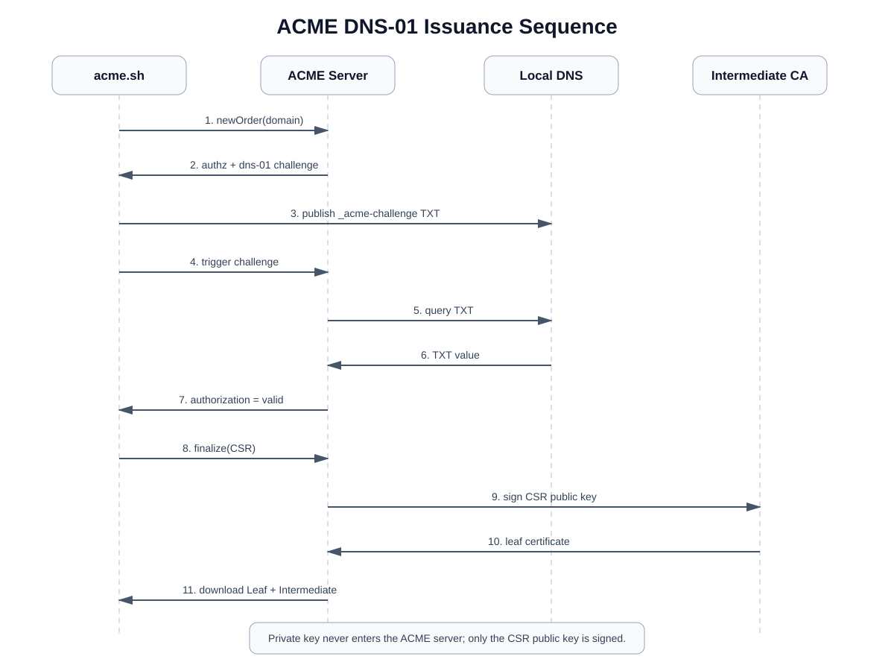
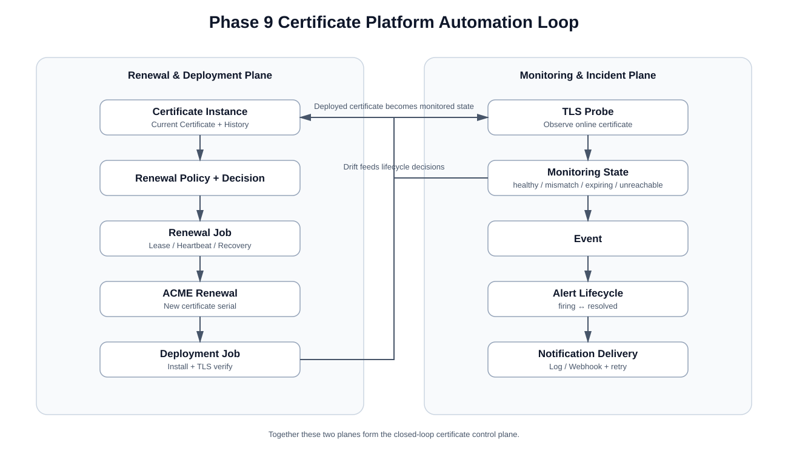
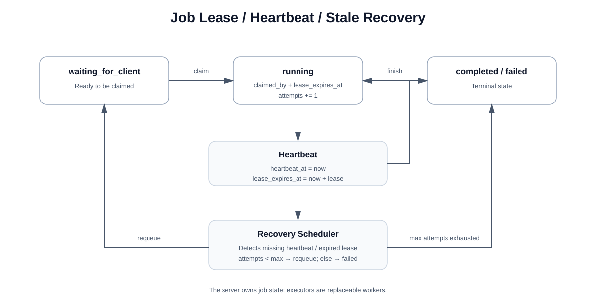

# go-pki-lab

A Go-based local PKI and certificate authority lab for learning certificate chains, DNS-01 validation, CSR signing, TLS, persistence, renewal, revocation, CRL, OCSP, ACME, and certificate-platform workflows.

> Local research only. Do not use generated CA keys in production.

## Progress

```text
Phase 1  [done] Root CA -> Intermediate CA -> Leaf -> x509.Verify
Phase 2  [done] Local DNS server + TXT records + DNS-01 challenge
Phase 3  [done] Certificate Order HTTP API
Phase 4  [done] Trusted local HTTPS
Phase 5  [done] Client-owned private key + CSR signing
Phase 6  [done] Persistent CA/order/certificate storage
Phase 7  [done] Renewal + revocation + CRL + RFC 6960 OCSP
Phase 8  [done] ACME protocol
         8.1 [done] Directory + Nonce + JWS + Account + Order
         8.2 [done] DNS-01 + Finalize CSR + Certificate download
         8.3 [done] acme.sh end-to-end compatibility + local DNS hook
         8.4 [done] Persistent ACME Account/Order/issuance state
         8.5 [done] ACME revokeCert + unified CRL/OCSP/status
         8.6 [done] ACME renewal + certificate rotation
         8.7 [done] Domain certificate history + lifecycle query
Phase 9  [in progress] Certificate platform capabilities
         9.1 [done] Domain certificate instance + current certificate selection
         9.2 [done] Persistent renewal policy + renewal decision
         9.3 [done] Renewal scheduler + persistent renewal jobs
         9.4 [done] Client renewal executor + job lifecycle closure
         9.5 [done] Deployment target + deployment executor + TLS verification
         9.6 [done] Certificate monitoring + drift detection
         9.7 [done] Event + alert lifecycle
         9.8 [done] Notification delivery + log/webhook sinks
         9.9 [done] Job lease + heartbeat + stale recovery
```

## Visual architecture guide

These diagrams provide five complementary views of the project. A good reading order is:

```text
Overall Architecture
  -> ACME DNS-01 Sequence
  -> Certificate Lifecycle
  -> Platform Automation Loop
  -> Job Lease / Recovery
```

### Overall architecture

This is the highest-level view of `go-pki-lab`: clients enter through the API server, the platform service coordinates PKI, ACME, DNS, persistence, and the certificate automation layer.



### Certificate lifecycle

This diagram follows one certificate from client-generated CSR through validation, issuance, deployment, monitoring, renewal, revocation, and history.



### ACME DNS-01 issuance sequence

The ACME client owns the private key. The server returns a DNS-01 challenge, the client publishes the TXT record, the ACME server validates it through the local DNS server, and only the CSR public key is sent to the CA for signing.



### Certificate platform automation loop

Phase 9 adds a certificate control plane above issuance: renewal and deployment form one side of the loop; monitoring, incident state, and notifications form the other.



### Job lease, heartbeat, and stale recovery

Renewal and deployment executors are replaceable workers. The server owns job state and uses leases plus heartbeats to detect a crashed executor and requeue stale work.



The SVG source files are stored under:

```text
docs/images/
├── architecture-overview.svg
├── certificate-lifecycle.svg
├── acme-dns01-sequence.svg
├── platform-automation-loop.svg
└── job-lease-recovery.svg
```

## Architecture (text reference)

```text
                         go-pki-lab :8080
                               |
        +----------------------+----------------------+
        |                                             |
        v                                             v
 Certificate Platform API                       ACME RFC 8555 API
        |                                             |
        +----------------------+----------------------+
                               |
                        Persistent CA
                  data/ca/root-ca.{crt,key}
            data/ca/intermediate-ca.{crt,key}
                               |
                     +---------+---------+
                     |                   |
                     v                   v
              platform Orders       ACME state
              data/orders/*      data/acme/state.json
                     |                   |
                     +---------+---------+
                               |
                               v
                     CertificateState
                               |
                   +-----------+-----------+
                   |                       |
                   v                       v
          Certificate History      Certificate Instance
                                           |
                                           v
                                  Current Certificate
                                           |
                                           v
                                     Renewal Policy
                                           |
                                           v
                                    Renewal Decision
                                           |
                                           v
                                  Renewal Scheduler
                                           |
                                           v
                                      Renewal Job
                                  waiting_for_client
```

The leaf private key and ACME account private key stay on the client side.

## Requirements

- Go 1.24+

```bash
go mod tidy
go test ./...
```

## Start the platform

```bash
go run ./cmd/api-server
```

Defaults:

```text
HTTP API          : http://127.0.0.1:8080
ACME directory    : http://127.0.0.1:8080/acme/directory
DNS               : 127.0.0.1:1053/udp
Persistent data   : ./data
ACME state        : ./data/acme/state.json
Renewal policies  : ./data/renewal-policies/
Renewal jobs      : ./data/renewal-jobs/
Renewal scan      : 1m
```

The first startup creates the Root and Intermediate CA. Later startups load the same CA, ACME protocol state, renewal policies, and renewal jobs from disk.

## Persistent server data

```text
data/
├── ca/
│   ├── root-ca.crt
│   ├── root-ca.key
│   ├── intermediate-ca.crt
│   └── intermediate-ca.key
├── orders/
│   └── <platform-order-id>.json
├── renewal-policies/
│   └── <domain-sha256>.json
├── renewal-jobs/
│   └── <job-id>.json
└── acme/
    └── state.json
```

`data/` is ignored by Git. Never commit or distribute CA private keys.

The canonical trust anchor is:

```text
data/ca/root-ca.crt
```

Clients can obtain a copy through:

```bash
curl -s http://127.0.0.1:8080/ca/root -o ./client/root-ca.crt
```

`root-ca.crt` is not generated automatically into `client/`.

## ACME endpoints

```text
GET  /acme/directory
HEAD /acme/new-nonce
GET  /acme/new-nonce
POST /acme/new-account
POST /acme/acct/{id}
POST /acme/new-order
POST /acme/order/{id}
POST /acme/authz/{id}
POST /acme/challenge/{id}
POST /acme/finalize/{id}
POST /acme/cert/{id}
POST /acme/revoke-cert
```

The implementation validates flattened JSON JWS, one-time `Replay-Nonce`, `url`, `jwk`/`kid`, ES256 signatures, and RS256 signatures for lab compatibility.

## ACME end-to-end flow

```text
Directory
   -> Nonce
   -> newAccount
   -> newOrder
   -> Authorization + dns-01 token
   -> local TXT publication
   -> POST challenge
   -> Order ready
   -> Finalize CSR
   -> Persistent Intermediate CA signs CSR
   -> Order valid
   -> POST-as-GET certificate URL
   -> Leaf + Intermediate PEM chain
```

ACME DNS-01 uses the standard value:

```text
keyAuthorization = token + "." + accountJWKThumbprint
TXT value        = base64url(SHA256(keyAuthorization))
```

Certificate download returns a PEM chain containing Leaf + Intermediate. The Root CA is intentionally not included.

## Test with acme.sh

A custom DNS hook is included at:

```text
scripts/acme.sh/dns_go_pki_lab.sh
```

Install it:

```bash
cp ./scripts/acme.sh/dns_go_pki_lab.sh \
  ~/.acme.sh/dnsapi/dns_go_pki_lab.sh
```

Then issue a local certificate:

```bash
export GO_PKI_LAB_API=http://127.0.0.1:8080

~/.acme.sh/acme.sh --issue \
  --server http://127.0.0.1:8080/acme/directory \
  --dns dns_go_pki_lab \
  --dnssleep 1 \
  -d hello.test \
  --keylength ec-256 \
  --accountkeylength ec-256 \
  --force \
  --debug 2
```

`--dnssleep 1` is important because the lab TXT record exists only on the local authoritative DNS server, not on public DNS/DoH resolvers.

The hook automatically performs:

```text
dns_go_pki_lab_add -> POST /dns/txt
ACME validation     -> local DNS :1053
dns_go_pki_lab_rm  -> DELETE /dns/txt
```

Detailed acme.sh instructions:

```text
docs/phase8-acmesh.md
```

## ACME persistence and restart recovery

ACME protocol state is stored in:

```text
data/acme/state.json
```

Persisted:

```text
Account ID
Account status/contact
Account public JWK + thumbprint
ACME Orders
challenge token + DNS-01 value
Order status
Challenge status
Authorization status
validation timestamp
ACME-issued PEM certificate chain
revocation timestamp/reason
```

Not persisted:

```text
Replay-Nonce values
Local DNS TXT records
```

Nonces are intentionally short-lived and single-use. A pending DNS-01 challenge may need its TXT record republished after restart.

The ACME state file is written atomically and uses file mode `0600`. It contains only the account public JWK; the account private key remains with the ACME client.

Restart test and details:

```text
docs/phase8-acme-persistence.md
```

## Certificate history

Query every issued certificate generation for a DNS name:

```bash
curl -s \
  'http://127.0.0.1:8080/certificates?domain=hello2.test' \
  | jq
```

The result includes each independent certificate generation with:

```text
serial_number
order_id
status
not_before
not_after
revoked_at
revocation_reason
```

History is sorted newest-first and includes certificates issued through both the original platform flow and ACME.

Details:

```text
docs/phase8-certificate-history.md
```

## Domain certificate instance

Phase 9 introduces a platform-level certificate instance above protocol Orders.

```text
Domain
  |
  v
Certificate Instance
  |
  +--> Current Certificate
  `--> Certificate History
```

Query it with:

```bash
curl -s \
  http://127.0.0.1:8080/domains/hello2.test/certificate-instance \
  | jq
```

The current certificate is the newest issued generation whose lifecycle status is `good`. Revoked, expired, and not-yet-valid certificates are never selected as current.

Details:

```text
docs/phase9-certificate-instance.md
```

## Renewal policy

Configure a persistent policy for a managed domain:

```bash
curl -s -X PUT \
  http://127.0.0.1:8080/domains/hello2.test/renewal-policy \
  -H 'Content-Type: application/json' \
  -d '{"auto_renew":true,"renew_before_days":30}' \
  | jq
```

Read the policy and evaluate whether the current certificate is inside the renewal window:

```bash
curl -s http://127.0.0.1:8080/domains/hello2.test/renewal-policy | jq
curl -s http://127.0.0.1:8080/domains/hello2.test/renewal-decision | jq
```

Details:

```text
docs/phase9-renewal-policy.md
```

## Renewal scheduler

Phase 9.3 turns renewal decisions into persistent jobs. The scheduler performs one scan at startup and then scans every minute by default.

For a faster local test:

```bash
go run ./cmd/api-server -renewal-scan-interval 5s
```

Run a scan manually:

```bash
curl -s -X POST http://127.0.0.1:8080/renewal-scheduler/run | jq
```

Query jobs:

```bash
curl -s http://127.0.0.1:8080/renewal-jobs | jq
curl -s 'http://127.0.0.1:8080/renewal-jobs?domain=hello2.test' | jq
```

A due domain gets one persistent job with:

```text
status = waiting_for_client
```

Repeated scans do not create another open job for the same domain.

The server intentionally does not finalize the renewed certificate itself yet because the leaf private key remains client-owned. The next phase adds the client-side renewal executor.

Details:

```text
docs/phase9-renewal-scheduler.md
```

## Tests

```bash
go test ./internal/platform -v
go test ./internal/persistence -v
go test ./internal/acme -v
go test ./...
```

The tests cover real cryptographic operations and platform state:

```text
P-256 account key
-> ES256 JWS
-> Account
-> Order
-> Authorization
-> DNS TXT publication
-> UDP DNS-01 validation
-> client-generated CSR
-> CA signing
-> certificate download
-> X.509 chain verification
-> state save/load
-> JWK public-key reconstruction
-> order/lifecycle/certificate restoration
-> revocation
-> renewal/rotation
-> certificate history
-> current-certificate selection
-> renewal policy persistence
-> renewal-window decision
-> renewal job creation
-> scheduler duplicate prevention
-> renewal job restart recovery
```

## Non-ACME certificate API

The original platform flow remains available for learning and comparison:

```text
POST   /orders
GET    /orders/{id}
POST   /orders/{id}/validate
POST   /orders/{id}/issue
POST   /dns/txt
GET    /dns/txt
DELETE /dns/txt
```

## Local HTTPS

Map:

```text
127.0.0.1 hello.test
```

Start HTTPS with a client-owned key and issued full chain:

```bash
go run ./cmd/https-server \
  -domain hello.test \
  -addr 127.0.0.1:8443 \
  -cert ./client/fullchain.pem \
  -key ./client/hello.test.key
```

Test:

```bash
curl --cacert ./data/ca/root-ca.crt https://hello.test:8443/
```

## Certificate lifecycle APIs

```text
POST /orders/{id}/renew
POST /orders/{id}/revoke
GET  /certificates?domain={domain}
GET  /certificates/{serial}/status
GET  /domains/{domain}/certificate-instance
GET  /domains/{domain}/renewal-policy
PUT  /domains/{domain}/renewal-policy
GET  /domains/{domain}/renewal-decision
POST /renewal-scheduler/run
GET  /renewal-jobs
GET  /renewal-jobs/{id}
GET  /ca/crl
POST /ocsp
```

Detailed lifecycle walkthrough:

```text
docs/phase7-lifecycle.md
```

### RFC 6960 OCSP

```bash
openssl ocsp \
  -issuer ./data/ca/intermediate-ca.crt \
  -cert ./client/hello.test.crt \
  -url http://127.0.0.1:8080/ocsp \
  -CAfile ./data/ca/root-ca.crt \
  -no_nonce \
  -resp_text
```

Before revocation the status should be `good`; after revocation it should be `revoked`.

## Current limitations

- one DNS identifier per ACME Order
- DNS-01 only
- no wildcard-specific ACME behavior yet
- local DNS TXT records are not persistent
- ACME challenge validation is synchronous
- persisted ACME resource URLs assume the same externally visible ACME base URL after restart
- no account key rollover
- no External Account Binding
- renewal jobs currently wait for a client-side executor
- no deployment target abstraction yet
- renewal in the non-ACME API currently reuses the original CSR/public key
- CRL number is not yet a persisted monotonic counter
- no delta CRL
- leaf certificates do not yet contain CRL Distribution Point or OCSP AIA URLs
- OCSP nonce handling is not implemented
- OCSP responses are signed directly by the Intermediate CA rather than a delegated responder certificate
- no KMS/HSM integration or production-grade CA key protection

## Legacy all-in-one CLI

```bash
go run ./cmd/pki-server -domain hello.test -out ./out
```

This creates an isolated CA and certificate chain under `out/`; it does not use the persistent CA under `data/ca/`.

### Phase 9.6: Certificate monitoring

Enabled deployment targets are periodically probed for online certificate identity,
hostname, expiry, and drift from the platform Current Certificate. Latest observations
persist with each target. See [monitoring configuration, APIs, and status rules](docs/phase9-certificate-monitoring.md).
